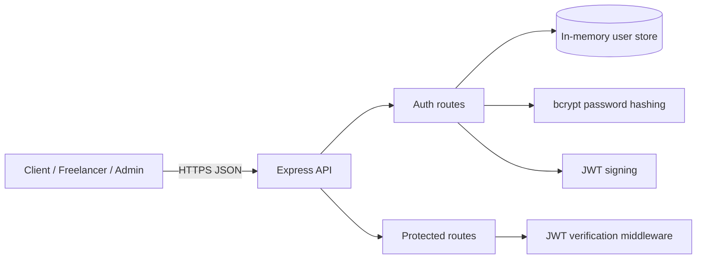

# HustleHub+ Backend

Secure foundations API for the HustleHub+ platform. Part 1 supports account registration, login, and a JWT-protected dashboard for Clients, Freelancers, and Admins.

## System Overview

The API is an Express application served over HTTPS in local development. Users register with an email, password, and role. Passwords are hashed before storage, and successful registration or login returns a short-lived JWT.



The in-memory store is intentionally temporary for Part 1. Restarting the server clears users.

## Project Structure

```text
src/
├── config/cert/       Local HTTPS key and certificate (ignored by Git)
├── controllers/       Registration, login, and dashboard behavior
├── middleware/        Validation, authentication, and error handling
├── models/            In-memory user model
├── routes/            Express route definitions
└── utils/             Password and JWT helpers
scripts/               Local certificate generation
server.js              Express app and HTTPS entry point
```

## Security Decisions

- **Password hashing:** `bcryptjs` hashes passwords with 10 salt rounds. Plaintext passwords are never stored or returned.
- **JWT:** tokens are signed with `JWT_SECRET` and expire after one hour. Protected routes verify the signature before using token claims.
- **Input validation:** `express-validator` enforces normalized email addresses, eight-character minimum passwords, uppercase/lowercase/number/special-character requirements, and approved roles.
- **HTTPS:** a self-signed localhost certificate encrypts local traffic. It is suitable for development only; production should use a certificate issued by a trusted authority.
- **Error handling:** production responses hide stack traces and use a generic message. Development responses include the stack to aid debugging.
- **Additional controls:** Helmet security headers, CORS support, and a 10 KB JSON body limit are enabled.

## Setup

Requirements: Node.js 18 or newer.

```powershell
npm.cmd install
Copy-Item .env.example .env
npm.cmd run cert:generate
npm.cmd start
```

The API starts at `https://localhost:8443`. Because the certificate is self-signed, disable SSL certificate verification in Postman or trust the certificate in your local client. Do not commit `.env` or PEM files.

## Postman

The Postman files are in the `postman/` folder:

1. Import `HustleHub-Local.postman_environment.json`.
2. Import `HustleHub-Part1.postman_collection.json`.
3. Select the `HustleHub Local` environment in Postman.
4. Confirm the `baseUrl` variable is `https://localhost:8443`.
5. In Postman Settings, turn off SSL certificate verification for the self-signed local certificate.
6. Run `Health`, then `Register Freelancer` or `Login`, and finally `Protected Dashboard`.

The login and registration requests automatically save the returned JWT in the environment's `token` variable. The base URL for this local server is:

```text
https://localhost:8443
```

For development with automatic restart:

```powershell
npm.cmd run dev
```

PowerShell may block `npm.ps1` under a restrictive execution policy; `npm.cmd` works without changing that policy.

## API Endpoints

### Register

`POST /api/auth/register`

```json
{
  "email": "freelancer@example.com",
  "password": "SecurePass123!",
  "role": "freelancer"
}
```

Returns `201` with a token and public user details. Duplicate emails return `400`; invalid input returns `400` with validation errors.

### Login

`POST /api/auth/login`

```json
{
  "email": "freelancer@example.com",
  "password": "SecurePass123!"
}
```

Returns `200` with a token and public user details. Invalid credentials return `401`.

### Dashboard

`GET /api/protected/dashboard`

```text
Authorization: Bearer <token>
```

Returns `200` with the authenticated JWT claims. Missing or invalid tokens return `401`.

### Health

`GET /health` returns `{ "status": "ok" }` and is useful for a basic availability check.

## Testing

Run the automated API checks with:

```powershell
npm.cmd test
```

The tests cover registration, login, JWT-protected access, validation rejection, and missing authentication.

## Submission Checklist

- [x] Dependencies and scripts configured
- [x] Environment template and Git exclusions added
- [x] HTTPS certificate generation documented and automated
- [x] In-memory user store implemented
- [x] bcrypt password hashing implemented
- [x] JWT generation and verification implemented
- [x] Registration and login routes implemented
- [x] Input validation implemented
- [x] Global error handling implemented
- [x] Protected route implemented
- [x] Automated API tests included
- [x] README documentation included
